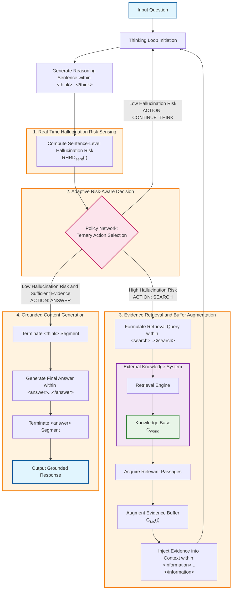

# Grounded-R1 Flowchart

This diagram illustrates the four-phase rollout generation process of the Grounded-R1 framework.

## Diagram Description

The flowchart depicts the following four-phase process:

1. **Real-Time Hallucination Risk Sensing**: Computation of sentence-level hallucination risk using RHRD.
2. **Adaptive Risk-Aware Decision**: Policy network selects from three actions based on risk assessment.
3. **Evidence Retrieval and Buffer Augmentation**: External knowledge retrieval and evidence buffer updates.
4. **Grounded Content Generation**: Final answer generation with evidence grounding.
